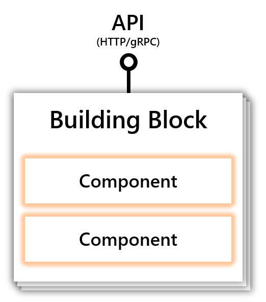
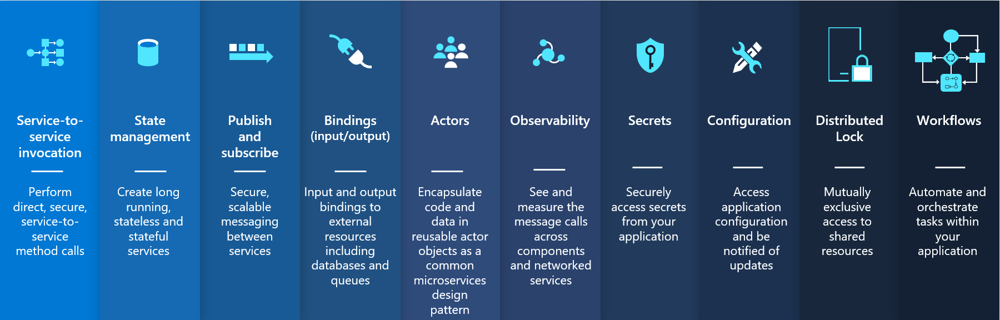

# Будівельні блоки (Building blocks)

**Модульні найкращі практики, доступні через стандартні API HTTP або gRPC** 

(**Modular best practices accessible over standard HTTP or gRPC APIs**)

Будівельний блок - це HTTP або gRPC API, 
який можна викликати з вашого коду і який використовує 
один або декілька компонентів Dapr.

>(_A building block is an HTTP or gRPC API that can be called 
from your code and uses one or more Dapr components._)

Структурні елементи вирішують загальні проблеми при створенні 
стійких додатків для мікросервісів і кодифікують найкращі практики 
та шаблони. 
Dapr складається з набору будівельних блоків, 
з можливістю розширення для додавання нових будівельних блоків.

>(_Building blocks address common challenges in building resilient, 
microservices applications and codify best practices and patterns. 
Dapr consists of a set of building blocks, with extensibility 
to add new building blocks._)

На наведеній нижче схемі показано, як будівельні блоки 
розкривають публічний API, який викликається з вашого коду, 
використовуючи компоненти для реалізації можливостей 
будівельних блоків.

>(_The diagram below shows how building blocks expose 
a public API that is called from your code, using components 
to implement the building blocks’ capability._)

Нижче наведені будівельні блоки, надані Dapr:

>(_The following are the building blocks provided by Dapr:_)

**[Service-to-service invocation](service-to-service%20invocation/Readme.md)**

`/v1.0/invoke`

Виклик сервісів дозволяє програмам спілкуватися один з одним через відомі кінцеві точки 
у вигляді http або gRPC-повідомлень. Dapr надає кінцеву точку, яка діє як комбінація 
зворотного проксі з вбудованим виявленням сервісів, використовуючи при цьому вбудоване 
розподілене трасування і обробку помилок.

>(_Service invocation enables applications to communicate with each 
other through well-known endpoints in the form of http or gRPC messages. 
Dapr provides an endpoint that acts as a combination of a reverse proxy 
with built-in service discovery, while leveraging built-in distributed tracing and error handling._)

[**State management**](state/Readme.md)

`/v1.0/state`

Стан програми - це все, що програма хоче зберегти після завершення одного сеансу роботи. 
Dapr надає API станів та запитів на основі ключів/значень з можливістю підключення сховищ 
станів для забезпечення стійкості.

>(_Application state is anything an application wants to preserve beyond a single session. 
>Dapr provides a key/value-based state and query APIs with pluggable state stores for persistence._)

[**Publish and subscribe**](publish/Readme.md)

`/v1.0/publish` та `/v1.0/subscribe`

Pub/Sub - це слабко пов'язаний шаблон обміну повідомленнями, 
в якому відправники (або видавці) публікують повідомлення на тему, на яку підписуються підписники. 
Dapr підтримує патерн pub/sub між програмами.

>(_Pub/Sub is a loosely coupled messaging pattern where senders (or publishers) publish messages 
>to a topic, to which subscribers subscribe. Dapr supports the pub/sub pattern between applications._)

[**Bindings**](Bindings/Readme.md)

`/v1.0/bindings`

Прив'язка забезпечує двостороннє з'єднання із зовнішнім хмарним/локальним сервісом або системою. 
Dapr дозволяє викликати зовнішній сервіс через API прив'язки Dapr, 
а також дозволяє вашому додатку запускатися подіями, що надсилаються підключеним сервісом.

>(_A binding provides a bi-directional connection to an external cloud/on-premise service or system. 
>Dapr allows you to invoke the external service through the Dapr binding API, 
>and it allows your application to be triggered by events sent by the connected service._)

[**Actors**](actors/Readme.md)

`/v1.0/actors`

Актор - це ізольована, незалежна одиниця обчислень і стану з однопотоковим виконанням. 
Dapr надає реалізацію акторів на основі шаблону віртуального актора, який забезпечує однопотокову 
модель програмування, де актори є сміттям, яке збирається, коли вони не використовуються.

>(_An actor is an isolated, independent unit of compute and state with single-threaded execution. 
>Dapr provides an actor implementation based on the virtual actor pattern which provides 
>a single-threaded programming model and where actors are garbage collected when not in use._)

**Observability**

`відсутнє`

Компоненти системи Dapr та середовище виконання генерують метрики, журнали та трасування для налагодження, 
роботи та моніторингу системних служб, компонентів та користувацьких додатків Dapr.

>(_Dapr system components and runtime emit metrics, logs, and traces 
>to debug, operate and monitor Dapr system services, components and user applications._)

[**Secrets**](secrets/Readme.md)

`/v1.0/secrets`

Dapr надає API будівельного блоку секретів та інтегрується зі сховищами секретів, такими 
як загальнодоступні хмарні сховища, локальні сховища та Kubernetes для зберігання секретів.
Сервіси можуть викликати API секретів для отримання секретів, наприклад, для отримання рядка 
з'єднання з базою даних.

>(_Dapr provides a secrets building block API and integrates with secret stores such as public 
> cloud stores, local stores and Kubernetes to store the secrets. Services can call the secrets 
> API to retrieve secrets, for example to get a connection string to a database_)

**Configuration**

`/v1.0-alpha1/configuration`
API конфігурації дозволяє отримувати та підписуватися на елементи конфігурації програми для підтримуваних сховищ конфігурацій. 
Це дозволяє програмі отримувати певну інформацію про конфігурацію, наприклад, під час запуску або при внесенні змін до сховища конфігурації.

>(_The Configuration API enables you to retrieve and subscribe to application configuration items 
>for supported configuration stores. This enables an application to retrieve specific configuration 
>information, for example, at start up or when configuration changes are made in the store._)

[**Distributed lock**](distributed%20lock/Readme.md)

`/v1.0-alpha1/lock`

API розподіленого блокування дозволяє блокувати ресурс так, 
щоб декілька екземплярів програми могли отримати доступ до ресурсу без конфліктів і забезпечити гарантії узгодженості.

>(_The distributed lock API enables you to take a lock on a resource so that multiple instances of an application 
>can access the resource without conflicts and provide consistency guarantees._)

[**Workflows**](workflow%2FReadme.md)

`/v1.0-alpha1/workflow`

Workflow API дозволяє вам визначати довготривалі, постійні процеси або потоки даних, 
які охоплюють декілька мікросервісів, використовуючи робочі процеси або компоненти робочих процесів Dapr. 
Workflow API можна комбінувати з іншими будівельними блоками Dapr API. 
Наприклад, робочий процес може викликати інший сервіс за допомогою виклику сервісу або отримувати секрети, 
забезпечуючи гнучкість і портативність.

>(_The Workflow API enables you to define long running, persistent processes or data flows 
>that span multiple microservices using Dapr workflows or workflow components. 
>The Workflow API can be combined with other Dapr API building blocks. 
>For example, a workflow can call another service with service invocation 
>or retrieve secrets, providing flexibility and portability._)