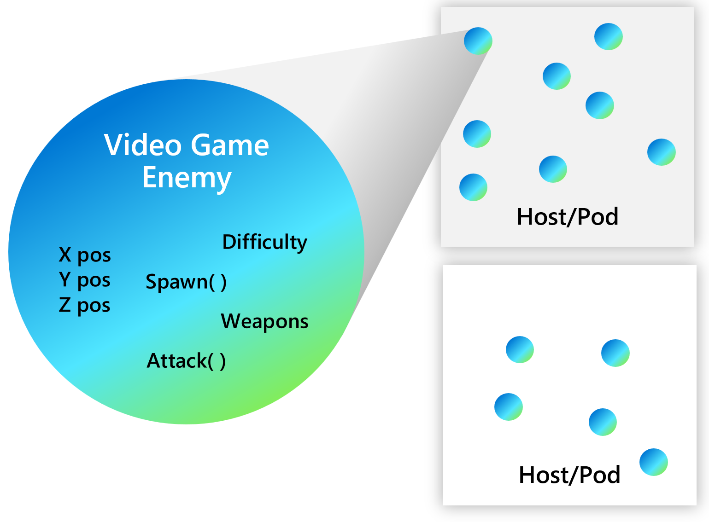
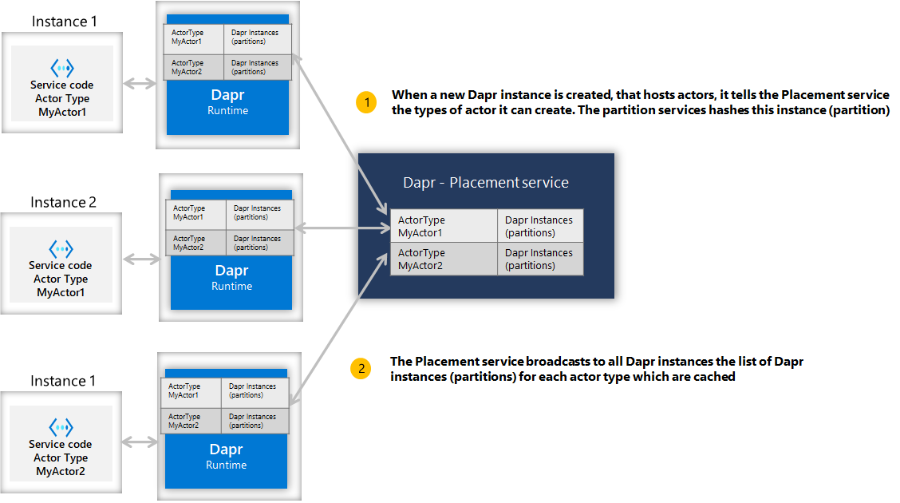
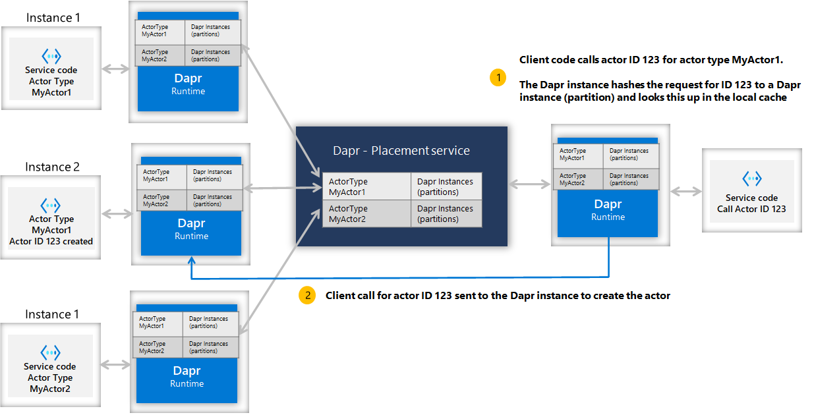
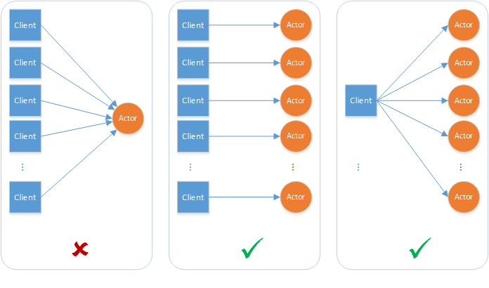
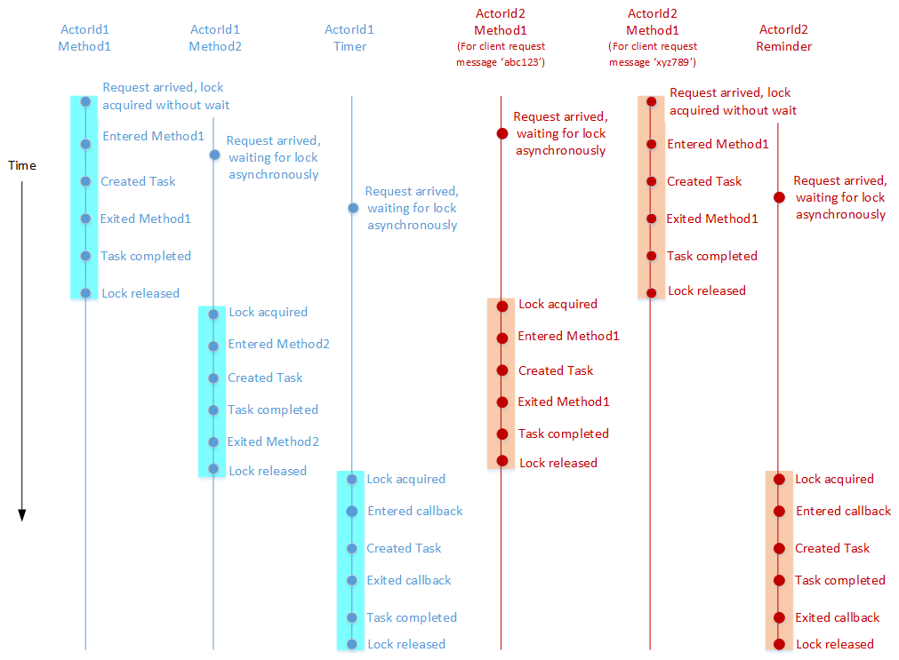

# Огляд акторів (Actors overview)

**Огляд будівельного блоку API акторів** (**Overview of the actors API building block**)

## Вступ (Introduction)


Акторний патерн описує акторів як "одиницю обчислення" найнижчого рівня.
Іншими словами, ви пишете свій код в автономному блоці (який називається актором), 
який отримує повідомлення і обробляє їх по одному, 
без будь-якого паралелізму або багатопотоковості.

(The actor pattern describes actors as the lowest-level “unit of computation”. In other words, you write your code in a self-contained unit (called an actor) that receives messages and processes them one at a time, without any kind of concurrency or threading.)

Поки ваш код обробляє повідомлення, він може надсилати одне або 
декілька повідомлень іншим акторам або створювати нові актори. 
Базове середовище виконання керує тим, як, коли і де запускається 
кожен актор, а також маршрутизує повідомлення між акторами.

(While your code processes a message, it can send one or more messages to other actors, or create new actors. An underlying runtime manages how, when and where each actor runs, and also routes messages between actors)

Велика кількість акторів може виступати одночасно, і 
актори виступають незалежно один від одного.

(A large number of actors can execute simultaneously, and actors execute independently from each other.)

Dapr включає в себе середовище виконання, яке спеціально реалізує 
шаблон віртуального актора. Використовуючи Dapr, ви пишете свої 
актори Dapr відповідно до моделі `Actor`, а Dapr використовує гарантії 
масштабованості та надійності, які надає базова платформа

(Dapr includes a runtime that specifically implements the Virtual Actor pattern. With Dapr’s implementation, you write your Dapr actors according to the Actor model, and Dapr leverages the scalability and reliability guarantees that the underlying platform provides)

### Коли використовувати акторів (When to use actors)


Як і у випадку з будь-яким іншим технологічним рішенням, 
ви повинні вирішити, чи використовувати акторів, 
виходячи з проблеми, яку ви намагаєтеся вирішити.

(As with any other technology decision, you should decide whether to use actors based on the problem you’re trying to solve.)

Патерн проектування `Actor` може добре підходити до ряду проблем 
і сценаріїв розподілених систем, але перше, що вам слід врахувати - 
це обмеження патерну. 
Взагалі кажучи, розгляньте патерн `Actor` для моделювання 
вашої проблеми або сценарію, якщо:

(The actor design pattern can be a good fit to a number of distributed systems problems and scenarios, but the first thing you should consider are the constraints of the pattern. Generally speaking, consider the actor pattern to model your problem or scenario if:)

- Ваш проблемний простір включає велику кількість (тисячі або більше) маленьких, незалежних та ізольованих одиниць стану та логіки. (Your problem space involves a large number (thousands or more) of small, independent, and isolated units of state and logic)
- Ви хочете працювати з однопотоковими об'єктами, які не потребують значної взаємодії з зовнішніми компонентами, включаючи запити стану по набору акторів. (You want to work with single-threaded objects that do not require significant interaction from external components, including querying state across a set of actors.
- Ваші екземпляри акторів не блокуватимуть виклики з непередбачуваними затримками, виконуючи операції вводу/виводу. (Your actor instances won’t block callers with unpredictable delays by issuing I/O operations)

## Актори в Dapr (Actors in dapr)

Кожен актор визначається як екземпляр типу актора, так само, як об'єкт 
є екземпляром класу. Наприклад, може існувати тип актора, 
який реалізує функціональність калькулятора, 
і може бути багато акторів цього типу, 
розподілених на різних вузлах кластера. 
Кожен такий актор унікально ідентифікується за допомогою 
ідентифікатора актора.

(Every actor is defined as an instance of an actor type, identical to the way an object is an instance of a class. For example, there may be an actor type that implements the functionality of a calculator and there could be many actors of that type that are distributed on various nodes across a cluster. Each such actor is uniquely identified by an actor ID.)




## Час існування актора (Actor lifetime)

Актори Dapr є віртуальними, тобто час їхнього життя не прив'язаний до їхнього представлення в пам'яті. 
Як наслідок, їх не потрібно явно створювати або знищувати. Час виконання актора Dapr автоматично активує актора, 
коли вперше отримує запит на його ідентифікатор. 
Якщо актор не використовується протягом певного періоду часу, середовище виконання актора 
Dapr збирає сміття з об'єкта у пам'яті. 
Він також зберігає знання про існування актора, якщо його потрібно буде активувати пізніше.

> (_Dapr actors are virtual, meaning that their lifetime is not tied to their in-memory representation. As a result, they do not need to be explicitly created or destroyed. The Dapr actor runtime automatically activates an actor the first time it receives a request for that actor ID. If an actor is not used for a period of time, the Dapr actor runtime garbage-collects the in-memory object. It will also maintain knowledge of the actor’s existence should it need to be reactivated later._)

Виклик методів акторів та нагадувань обнуляє час простою, 
наприклад, запуск нагадування триматиме актора активним. 
Нагадування спрацьовують незалежно від того, активний актор чи неактивний, якщо нагадування 
спрацьовує для неактивного актора, воно активує актора першим. 
Таймери акторів не скидають час простою, тому спрацьовування таймера не зробить актора активним. 
Таймери спрацьовують лише тоді, коли актор активний.

>(_Invocation of actor methods and reminders reset the idle time, e.g. reminder firing will keep the actor active. 
Actor reminders fire whether an actor is active or inactive, if fired for inactive actor, 
it will activate the actor first. Actor timers do not reset the idle time, so timer firing will not keep the actor active. 
Timers only fire while the actor is active._)


Тайм-аут простою та інтервал сканування, який використовує Dapr, щоб перевірити, чи можна збирати сміття з актора, 
можна налаштовувати. Цю інформацію можна передати, коли Dapr звертається до служби акторів, 
щоб отримати підтримувані типи акторів.

>(_The idle timeout and scan interval Dapr runtime uses to see if an actor can be garbage-collected is configurable. 
>This information can be passed when Dapr runtime calls into the actor service to get supported actor types_)

Ця абстракція життя віртуального актора несе в собі деякі застереження, що є результатом моделі віртуального актора, 
і насправді реалізація Dapr Actors іноді відхиляється від цієї моделі.

>(_This virtual actor lifetime abstraction carries some caveats as a result of the virtual actor model, 
>and in fact the Dapr Actors implementation deviates at times from this model._)


Актор автоматично активується (що призводить до створення об'єкта актора), коли на його ідентифікатор 
надсилається перше повідомлення. Через деякий проміжок часу об'єкт актора видаляється у смітник. 
У майбутньому, повторне використання ідентифікатора актора призводить до створення нового об'єкта актора. 
Стан актора живе довше за життя об'єкта, оскільки стан зберігається у налаштованому провайдері 
станів для виконання Dapr.

>(_An actor is automatically activated (causing an actor object to be constructed) the first time a message 
>is sent to its actor ID. After some period of time, the actor object is garbage collected. 
>In the future, using the actor ID again, causes a new actor object to be constructed. 
>An actor’s state outlives the object’s lifetime as state is stored in configured state provider for Dapr runtime._)

## Розподіл і відмовостійкість (Distribution and failover)

Для забезпечення масштабованості та надійності екземпляри акторів розподілені по всьому кластеру, 
а Dapr автоматично мігрує їх з несправних вузлів на справні за потреби.

>(_To provide scalability and reliability, actors instances are distributed throughout the cluster and 
> Dapr automatically migrates them from failed nodes to healthy ones as required._)

Актори розподіляються між екземплярами сервісу акторів, 
а ці екземпляри розподіляються між вузлами кластера. 
Кожен екземпляр сервісу містить набір акторів для певного типу акторів.

>(_Actors are distributed across the instances of the actor service, 
>and those instance are distributed across the nodes in a cluster. 
>Each service instance contains a set of actors for a given actor type_)

### Сервіс розміщення акторів (Actor placement service)

Середовище виконання актора Dapr керує схемою розташування та налаштуваннями ключового діапазону для вас. 
Це робиться за допомогою служби `Placement` акторів. Коли створюється новий екземпляр сервісу, 
відповідне середовище виконання Dapr реєструє типи акторів, які воно може створити, 
а служба `Placement` обчислює розподіл між усіма екземплярами для даного типу актора. 
Ця таблиця інформації про розбиття для кожного типу акторів оновлюється і зберігається в кожному екземплярі Dapr, 
запущеному в середовищі, і може динамічно змінюватися при створенні і знищенні нових екземплярів служб акторів. 
Це показано на діаграмі нижче.

>(_The Dapr actor runtime manages distribution scheme and key range settings for you. 
This is done by the actor `Placement` service. When a new instance of a service is created, 
the corresponding Dapr runtime registers the actor types it can create and the `Placement` service calculates 
the partitioning across all the instances for a given actor type. This table of partition information 
for each actor type is updated and stored in each Dapr instance running in the environment and can change 
dynamically as new instance of actor services are created and destroyed. This is shown in the diagram below._)




Коли клієнт звертається до актора з певним ідентифікатором (наприклад, з ідентифікатором 123), екземпляр Dapr для клієнта хешує тип та ідентифікатор актора і використовує цю інформацію для виклику відповідного екземпляра Dapr, 
який може обслуговувати запити для цього конкретного ідентифікатора актора. 
В результаті, для будь-якого ідентифікатора актора завжди викликається один і той самий розділ (або екземпляр служби).

Це показано на діаграмі нижче.

> (_When a client calls an actor with a particular id (for example, actor id 123), the Dapr instance for the client hashes the actor type and id, and uses the information to call onto the corresponding Dapr instance that can serve the requests for that particular actor id. As a result, the same partition (or service instance) is always called for any given actor id. This is shown in the diagram below._)



Це спрощує деякі варіанти вибору, але також вимагає певних міркувань:
(_This simplifies some choices but also carries some consideration:_)

- За замовчуванням актори випадковим чином розподіляються по капсулах, що призводить до рівномірного розподілу. <br/>(_By default, actors are randomly placed into pods resulting in uniform distribution._)
- Оскільки актори розміщуються випадковим чином, слід очікувати, що операції з акторами завжди вимагають мережевої взаємодії, включаючи серіалізацію та десеріалізацію даних викликів методів, що призводить до затримок та накладних витрат.<br/> (_Because actors are randomly placed, it should be expected that actor operations always require network communication, including serialization and deserialization of method call data, incurring latency and overhead_)

>Примітка: Служба розміщення акторів `Placement` Dapr використовується лише для розміщення акторів і тому не потрібна, якщо ваші сервіси не використовують акторів Dapr. 
>
>Служба розміщення `Placement` може працювати в усіх хостингових середовищах, зокрема на власному хостингу та `Kubernetes`


>>
>>(Note: The Dapr actor Placement service is only used for actor placement and therefore is not needed if your services are not using Dapr actors. The Placement service can run in all hosting environments, including self-hosted and Kubernetes)

## Комунікація акторів (Actor communication)

Ви можете взаємодіяти з Dapr для виклику методу актора шляхом виклику кінцевої точки HTTP/gRPC.

>(You can interact with Dapr to invoke the actor method by calling HTTP/gRPC endpoint.)

```shell
POST/GET/PUT/DELETE http://localhost:3500/v1.0/actors/<actorType>/<actorId>/<method/state/timers/reminders>
```

Ви можете надати будь-які дані для методу актора в тілі запиту, а відповідь на запит буде в тілі відповіді, яка є даними з виклику актора.

>(You can provide any data for the actor method in the request body, and the response for the request would be in the response body which is the data from actor call)

>(Another, and perhaps more convenient, way of interacting with actors is via SDKs. Dapr currently supports actors SDKs in .NET, Java, and Python.)

>(Refer to Dapr Actor Features for more details)

### Паралельність (Concurrency)

Середовище виконання акторів Dapr забезпечує просту покрокову модель доступу до методів акторів. 
Це означає, що не більше одного потоку може бути активним всередині коду об'єкта актора в будь-який час. 
Покроковий доступ значно спрощує паралельні системи, оскільки немає необхідності в механізмах синхронізації 
для доступу до даних. Це також означає, що системи повинні бути розроблені з урахуванням особливостей 
однопотокового доступу до кожного екземпляру актора.

>(The Dapr actor runtime provides a simple turn-based access model for accessing actor methods. 
This means that no more than one thread can be active inside an actor object’s code at any time. 
Turn-based access greatly simplifies concurrent systems as there is no need for synchronization mechanisms for data access. 
It also means systems must be designed with special considerations for the single-threaded access nature of each actor instance.)

Один екземпляр актора не може обробляти більше одного запиту одночасно. 
Екземпляр актора може спричинити вузьке місце у пропускній здатності, якщо він має обробляти паралельні запити.

>(A single actor instance cannot process more than one request at a time. 
An actor instance can cause a throughput bottleneck if it is expected to handle concurrent requests.)

Актори можуть заблокувати один одного, якщо існує циклічний запит між двома агентами, 
в той час як зовнішній запит робиться до одного з них одночасно. 
Час виконання актора Dapr автоматично завершує виклик актора і видає виключення для того, хто його викликає, 
щоб перервати можливу тупикову ситуацію.

>(Actors can deadlock on each other if there is a circular request between two actors while an external request is made to one of the actors simultaneously. The Dapr actor runtime automatically times out on actor calls and throw an exception to the caller to interrupt possible deadlock situations)



### Реінтеграція (Reentrancy)

> (To allow actors to “re-enter” and invoke methods on themselves, see Actor Reentrancy.)

### Покроковий доступ (Turn-based access)

Такт складається з повного виконання методу актора у відповідь на запит від інших акторів або клієнтів, 
або повного виконання зворотного виклику за таймером/нагадуванням. 
Хоча ці методи та зворотні виклики є асинхронними, час виконання актора Dapr не чергує їх. 
Такт повинен бути повністю завершений до того, як буде дозволено новий такт. 
Іншими словами, метод актора або зворотний виклик таймера/нагадування, що виконується в даний момент, 
повинен бути повністю завершений до того, як буде дозволено новий виклик методу або зворотного виклику. 
Метод або зворотний виклик вважається завершеним, якщо виконання повернулося з методу або зворотного виклику, 
а завдання, що повертається методом або зворотним викликом, завершилося. 
Варто підкреслити, що потоковий паралелізм дотримується навіть у різних методах, таймерах та 
функціях зворотного виклику.


>(A turn consists of the complete execution of an actor method in response to a request from other actors or clients, 
or the complete execution of a timer/reminder callback. Even though these methods and callbacks are asynchronous, 
the Dapr actor runtime does not interleave them. A turn must be fully finished before a new turn is allowed. 
In other words, an actor method or timer/reminder callback that is currently executing must be fully finished before 
a new call to a method or callback is allowed. A method or callback is considered to have finished if the execution 
has returned from the method or callback and the task returned by the method or callback has finished. It is worth 
emphasizing that turn-based concurrency is respected even across different methods, timers, and callbacks.)

Виконання акторів Dapr забезпечує покрокове одночасне виконання, отримуючи блокування для кожного актора на початку 
такту і звільняючи його в кінці повороту. Таким чином, покрокове одночасне виконання забезпечується для кожного актора, 
а не для всіх акторів. Методи акторів та зворотні виклики таймерів/нагадувань можуть виконуватися 
одночасно від імені різних акторів.

>(The Dapr actor runtime enforces turn-based concurrency by acquiring a per-actor lock at the beginning of a turn 
and releasing the lock at the end of the turn. Thus, turn-based concurrency is enforced on a per-actor basis and 
not across actors. Actor methods and timer/reminder callbacks can execute simultaneously on behalf of different actors.)

Наступний приклад ілюструє вищезгадані концепції. Розглянемо тип актора, який реалізує два асинхронні методи 
(скажімо, `Method1` і `Method2`), таймер і нагадування. На діаграмі нижче показано приклад часової шкали 
виконання цих методів і зворотних викликів від імені двох акторів (`ActorId1` і `ActorId2`), які належать до цього типу акторів.

>(The following example illustrates the above concepts. Consider an actor type that implements two asynchronous methods 
(say, Method1 and Method2), a timer, and a reminder. The diagram below shows an example of a timeline for the 
execution of these methods and callbacks on behalf of two actors (ActorId1 and ActorId2) that belong to this actor type.)

