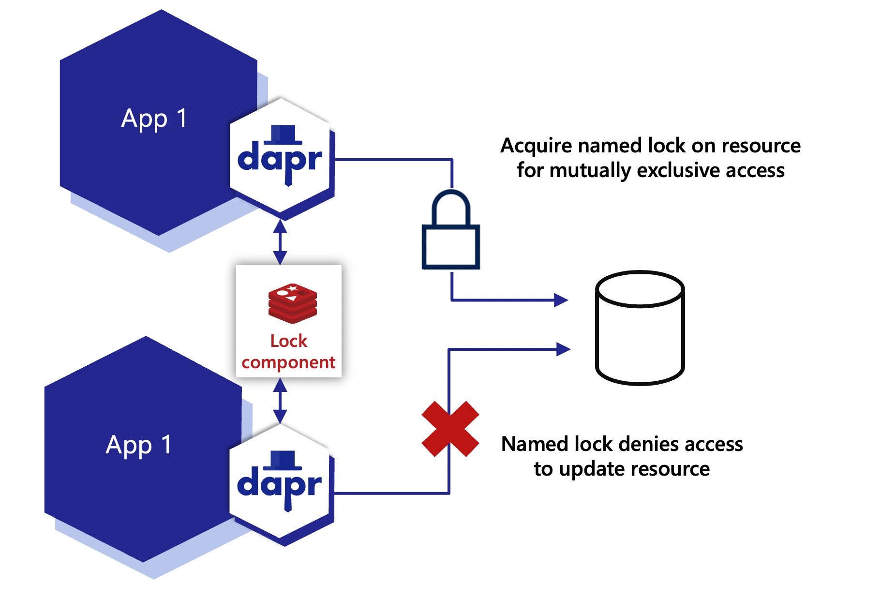

# Огляд розподілених блокувань  (Distributed lock overview)

**Огляд будівельного блоку API розподілених блокувань** 

(**Overview of the distributed lock API building block**)

## Вступ (Introduction)

Блокування використовуються для забезпечення взаємовиключного доступу 
до ресурсу. Наприклад, ви можете використати блокування для:

(Locks are used to provide mutually exclusive access to a resource. For example, you can use a lock to:)

- Надання ексклюзивного доступу до рядка, таблиці або всієї бази даних (Provide exclusive access to a database row, table, or an entire database)
- Блокування послідовного читання повідомлень з черги (Lock reading messages from a queue in a sequential manner)

Будь-який ресурс, до якого надається спільний доступ і в якому 
відбуваються оновлення, може бути об'єктом блокування. 
Блокування зазвичай використовуються на операціях, які змінюють стан, 
а не на читаннях.

(Any resource that is shared where updates occur can be the target for a lock. Locks are usually used on operations that mutate state, not on reads.)

Кожне блокування має ім'я. Програма визначає ресурси, до яких має 
доступ іменоване блокування. Зазвичай, декілька екземплярів однієї 
програми використовують це іменоване блокування для ексклюзивного 
доступу до ресурсу та виконання оновлень.

(Each lock has a name. The application determines the resources that the named lock accesses. Typically, multiple instances of the same application use this named lock to exclusively access the resource and perform updates.)

Наприклад, у паттерні конкуруючого споживача декілька екземплярів 
програми отримують доступ до черги. 
Ви можете вирішити, що хочете заблокувати чергу, 
поки програма виконує свою бізнес-логіку.

(For example, in the competing consumer pattern, multiple instances of an application access a queue. You can decide that you want to lock the queue while the application is running its business logic.)

На схемі нижче два екземпляри одного додатка, `App1`, використовують 
компонент `Redis lock` для блокування спільного ресурсу.

(In the diagram below, two instances of the same application, `App1`, 
use the `Redis lock` component to take a lock on a shared resource.)

- Перший екземпляр програми отримує іменоване блокування і отримує ексклюзивний доступ. (The first app instance acquires the named lock and gets exclusive access.)
- Другий екземпляр програми не може отримати блокування і тому не має доступу до ресурсу доти, доки блокування не буде знято:(The second app instance is unable to acquire the lock and therefore is not allowed to access the resource until the lock is released, either:)
  - Явно додатком через API розблокування, або (Explicitly by the application through the unlock API, or)
  - Через певний період часу, у зв'язку з закінченням терміну дії договору оренди (After a period of time, due to a lease timeout)

## Особливості (Features)

### Взаємовиключний доступ до ресурсу (Mutually exclusive access to a resource)

У будь-який момент часу лише один екземпляр програми може мати 
іменоване блокування. 
Блокування відображаються на ідентифікаторі додатка Dapr.

(At any given moment, only one instance of an application can hold a named lock. Locks are scoped to a Dapr app-id.)
### Використання лізингу без глухого кута (Deadlock free using leases)

Розподілені блокування Dapr використовують механізм блокування 
на основі оренди. Якщо програма отримує блокування, стикається 
з винятковою ситуацією і не може звільнити блокування, 
блокування автоматично звільняється через певний проміжок 
часу за допомогою оренди. 
Це запобігає блокуванню ресурсів у разі збоїв у роботі програми.

(Dapr distributed locks use a lease-based locking mechanism. If an application acquires a lock, encounters an exception, and cannot free the lock, the lock is automatically released after a period of time using a lease. This prevents resource deadlocks in the event of application failures)

## Демо (Demo)

Watch [this video for an overview of the distributed lock API](https://youtu.be/wLYYOJLt_KQ?t=583):