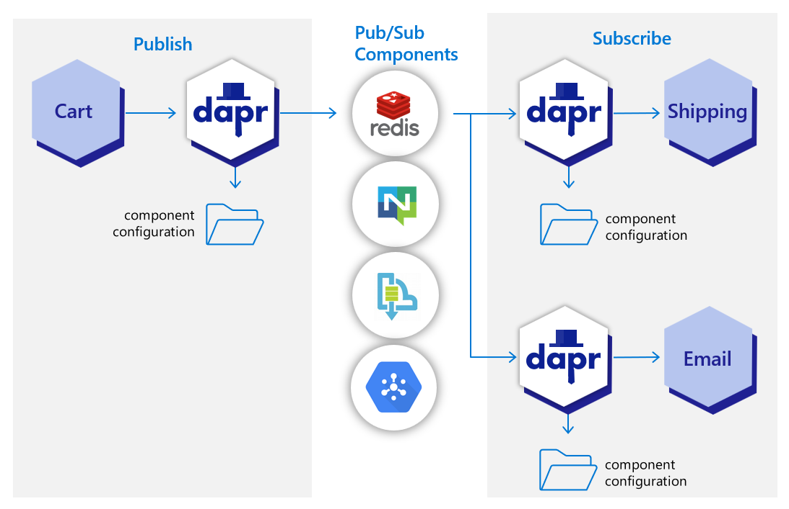

# Публікація та підписка на огляд (Publish and subscribe overview)

**Огляд будівельного блоку API pub/sub**
(**Overview of the pub/sub API building block**)

Публікація та підписка (pub/sub) дозволяє мікросервісам спілкуватися один з одним 
за допомогою повідомлень для архітектур, керованих подіями.

>(_Publish and subscribe (pub/sub) enables microservices to communicate with each other using messages for event-driven architectures._)

- Продюсер або **видавець** пише повідомлення на вхідний канал і надсилає їх до теми, не знаючи, яка програма їх отримає (_The producer, or publisher, writes messages to an input channel and sends them to a topic, unaware which application will receive them._)
- Споживач, або **підписник**, підписується на тему і отримує повідомлення з вихідного каналу, не знаючи, який сервіс створив ці повідомлення (The consumer, or subscriber, subscribes to the topic and receives messages from an output channel, unaware which service produced these messages.)

Брокер повідомлень-посередник копіює кожне повідомлення з вхідного каналу видавця на вихідний 
канал для всіх підписників, які зацікавлені в цьому повідомленні. 
Цей шаблон особливо корисний, коли вам потрібно відокремити мікросервіси один від одного.

>(_An intermediary message broker copies each message from a publisher’s input channel to an output channel for all subscribers interested in that message. This pattern is especially useful when you need to decouple microservices from one another._)

## Pub/sub API

API pub/sub в Dapr:
>(_The pub/sub API in Dapr:_)

- Надає API для діагностики платформи для надсилання та отримання повідомлень (_Provides a platform-agnostic API to send and receive messages._)
- Пропонує гарантію доставки повідомлень принаймні один раз (_Offers at-least-once message delivery guarantee._)
- Інтегрується з різними брокерами повідомлень та системами черг. (_Integrates with various message brokers and queuing systems._)
    
Конкретний брокер повідомлень, який використовується вашим сервісом, можна підключити 
і налаштувати як компонент Dapr pub/sub під час виконання. 
Це усуває залежність від вашого сервісу і робить його більш портативним та гнучким до змін.

>(_The specific message broker used by your service is pluggable and configured as a Dapr pub/sub component at runtime. This removes the dependency from your service and makes your service more portable and flexible to changes._)

При використанні pub/sub в Dapr: (_When using pub/sub in Dapr:_)

1. Ваш сервіс здійснює мережевий виклик до API будівельного блоку Dapr pub/sub.(_Your service makes a network call to a Dapr pub/sub building block API._)
2. Будівельний блок pub/sub викликає компонент Dapr pub/sub, який інкапсулює певний брокер повідомлень. (_The pub/sub building block makes calls into a Dapr pub/sub component that encapsulates a specific message broker._)
3. Щоб отримувати повідомлення на певну тему, Dapr підписується на компонент pub/sub від імені вашого сервісу з відповідною темою і доставляє повідомлення на кінцеву точку вашого сервісу, коли вони надходять(_To receive messages on a topic, Dapr subscribes to the pub/sub component on behalf of your service with a topic and delivers the messages to an endpoint on your service when they arrive._)

На наведеній нижче схемі служба "доставки" і служба "електронної пошти" підписалися на теми, 
опубліковані службою "кошика". Кожна служба завантажує файли конфігурації компонента pub/sub, 
які вказують на той самий компонент брокера повідомлень pub/sub; 
наприклад Redis Streams, NATS Streaming, Azure Service Bus або GCP pub/sub.

>(_In the diagram below, a “shipping” service and an “email” service have both subscribed to topics published by a “cart” service. Each service loads pub/sub component configuration files that point to the same pub/sub message broker component; for example: Redis Streams, NATS Streaming, Azure Service Bus, or GCP pub/sub._)

На наведеній нижче схемі API Dapr надсилає тему "замовлення" з сервісу "кошик" публікації 
до кінцевих точок "замовлення" в сервісах підписки "доставка" та "електронна пошта".

>(_In the diagram below, the Dapr API posts an “order” topic from the publishing “cart” service to “order” endpoints on the “shipping” and “email” subscribing services._)

[Переглянути повний список компонентів pub/sub, які підтримує Dapr](https://docs.dapr.io/reference/components-reference/supported-pubsub/).

>(_View the complete list of pub/sub components that Dapr supports._)

## Особливості (Features)

Будівельний блок pub/sub API надає вашому додатку кілька функцій

>(_The pub/sub API building block brings several features to your application._)

### Надсилання повідомлень за допомогою хмарних подій (Sending messages using Cloud Events)

Щоб увімкнути маршрутизацію повідомлень і надати додатковий контекст для кожного 
повідомлення між сервісами, Dapr використовує 
[специфікацію CloudEvents 1.0](https://github.com/cloudevents/spec/tree/v1.0) як формат повідомлень. 
Будь-яке повідомлення, надіслане програмою до теми, що використовує Dapr, 
автоматично загортається у конверт Cloud Events, використовуючи [значення 
заголовка](https://docs.dapr.io/developing-applications/building-blocks/pubsub/pubsub-overview/#content-types) `Content-Type` для атрибуту `datacontenttype `

>(_To enable message routing and provide additional context with each message between services, Dapr uses the CloudEvents 1.0 specification as its message format. Any message sent by an application to a topic using Dapr is automatically wrapped in a Cloud Events envelope, using `Content-Type` header value for `datacontenttype` attribute._)

>(_For more information, read about [messaging with CloudEvents](https://docs.dapr.io/developing-applications/building-blocks/pubsub/pubsub-cloudevents/), or [sending raw messages without CloudEvents](https://docs.dapr.io/developing-applications/building-blocks/pubsub/pubsub-raw/)._)

### Зв'язок з додатками, які не використовують Dapr та CloudEvents (Communication with applications not using Dapr and CloudEvents)

Якщо одна з ваших програм використовує Dapr, а інша ні, ви можете вимкнути обгортку CloudEvent 
для видавця або підписника. Це дозволить частково адаптувати Dapr pub/sub у додатках, 
які не можуть адаптувати Dapr одночасно.

>(_ If one of your applications uses Dapr while another doesn’t, you can disable the CloudEvent wrapping for a publisher or subscriber. This allows partial adoption of Dapr pub/sub in applications that cannot adopt Dapr all at once._)

>(_For more information, read [how to use pub/sub without CloudEvents](https://docs.dapr.io/developing-applications/building-blocks/pubsub/pubsub-raw/)_).

### Надсилання типу вмісту повідомлення (Setting message content types)

Публікуючи повідомлення, важливо вказати тип вмісту даних, що надсилаються. 
Якщо його не вказати, Dapr вважатиме, що це `text/plain`.

>(_When publishing a message, it’s important to specify the content type of the data being sent. Unless specified, Dapr will assume `text/plain`._)

- HTTP-клієнт: тип контенту можна задати в заголовку `Content-Type`. (HTTP client: the content type can be set in a `Content-Type` header)
- RPC-клієнт та SDK: мають спеціальний параметр типу контенту (gRPC client and SDK: have a dedicated content type parameter)

### Доставлення повідомлень (Message delivery)

В принципі, Dapr вважає повідомлення успішно доставленим, якщо абонент обробив його і відповів 
без помилок. Для більш детального контролю, API pub/sub Dapr також надає явні статуси, 
визначені у корисному навантаженні відповіді, за допомогою яких абонент вказує 
Dapr конкретні інструкції з обробки (наприклад, `RETRY` або `DROP`)

>(_In principle, Dapr considers a message successfully delivered once the subscriber processes the message and responds with a non-error response. For more granular control, Dapr’s pub/sub API also provides explicit statuses, defined in the response payload, with which the subscriber indicates specific handling instructions to Dapr (for example, RETRY or DROP)_).

### Отримання повідомлень з підписками на теми (Receiving messages with topic subscriptions)

Додатки Dapr можуть підписуватися на опубліковані теми двома способами, які підтримують однакові функції: декларативно і програмно.

>(_Dapr applications can subscribe to published topics via two methods that support the same features: declarative and programmatic._)

| Subscription method |	Description|
|---------------------|---|
| Declarative         |	Subscription is defined in an **external file**. The declarative approach removes the Dapr dependency from your code and allows for existing applications to subscribe to topics, without having to change code.|
|Programmatic|	Subscription is defined in the **user code**. The programmatic approach implements the subscription in your code.|

| Метод підписки | Опис |
|----------------|------|
| Декларативний  |Підписка визначається у **зовнішньому файлі**. Декларативний підхід видаляє залежність Dapr з вашого коду і дозволяє існуючим програмам підписуватися на теми без необхідності змінювати код|
| Програмний     |Підписка визначається в **коді користувача**. Програмний підхід реалізує підписку у вашому коді.|

Більше інформації про підписки читайте в розділі Методи підписки

>(_For more information, read [about the subscriptions in Subscription Methods](https://docs.dapr.io/developing-applications/building-blocks/pubsub/subscription-methods/)._)

### Маршрутизація повідомлень (Message routing)

Dapr надає [шаблон маршрутизації на основі вмісту](https://www.enterpriseintegrationpatterns.com/ContentBasedRouter.html). 
[Публічна/підпорядкована маршрутизація](https://docs.dapr.io/developing-applications/building-blocks/pubsub/howto-route-messages/) - це реалізація цього шаблону, яка дозволяє розробникам
використовувати вирази для маршрутизації [CloudEvents](https://cloudevents.io/) на основі їхнього вмісту 
до різних URI/шляхів та обробників подій у вашому додатку. 
Якщо жоден маршрут не збігається, використовується необов'язковий маршрут за замовчуванням. 
Це корисно, коли ваші програми розширюються для підтримки декількох версій подій 
або особливих випадків.

>(_Dapr provides content-based routing pattern. Pub/sub routing is an implementation of this pattern that allows developers to use expressions to route CloudEvents based on their contents to different URIs/paths and event handlers in your application. If no route matches, an optional default route is used. This is useful as your applications expands to support multiple event versions or special cases._)

Ця функція доступна як для декларативної, так і для програмної підписки.

>(_This feature is available to both the declarative and programmatic subscription approaches._)

>(_For more information on message routing, read [Dapr pub/sub API reference](https://docs.dapr.io/reference/api/pubsub_api/#provide-routes-for-dapr-to-deliver-topic-events))

### Обробка невдалих повідомлень з темами "мертвих" листів (Handling failed messages with dead letter topics)

Іноді повідомлення не можуть бути оброблені через низку можливих проблем, таких як помилкові 
умови в додатку виробника або споживача або несподівана зміна стану, яка викликає проблему 
в коді вашого додатку. Dapr дозволяє розробникам встановлювати теми "мертвих листів" 
для повідомлень, які не можуть бути доставлені в додаток. 
Ця функція доступна для всіх компонентів pub/sub і запобігає нескінченним повторним 
спробам користувацьких додатків доставити повідомлення, які не вдалося доставити.
Для отримання додаткової інформації, прочитайте про теми ["мертвих" листів](https://docs.dapr.io/developing-applications/building-blocks/pubsub/pubsub-deadletter/)

>(_Sometimes, messages can’t be processed because of a variety of possible issues, such as erroneous conditions within the producer or consumer application or an unexpected state change that causes an issue with your application code. Dapr allows developers to set dead letter topics to deal with messages that cannot be delivered to an application. This feature is available on all pub/sub components and prevents consumer applications from endlessly retrying a failed message. For more information, read about dead letter topics_)

### Простір імен груп споживачів (Namespace consumer groups)

Dapr вирішує проблему багатокористувацької оренди в масштабі за допомогою просторів 
імен для груп користувачів. 
Просто включіть значення `"{namespace}"` у метадані вашого компонента для груп споживачів, 
щоб дозволити декільком просторам імен з додатками з однаковим `app-id` публікувати та 
підписуватися на один і той самий брокер повідомлень
>(_Dapr solves multi-tenancy at-scale with namespaces for consumer groups. Simply include the `"{namespace}"` 
> value in your component metadata for consumer groups to allow multiple namespaces with applications of 
> the same `app-id` to publish and subscribe to the same message broker._)

### Гарантія принаймні на один раз (At-least-once guarantee)

Dapr гарантує принаймні одноразову семантику для доставки повідомлень. 
Коли програма публікує повідомлення у темі за допомогою API pub/sub, 
Dapr гарантує, що повідомлення буде доставлено принаймні один раз кожному підписнику

>(_Dapr guarantees at-least-once semantics for message delivery. When an application publishes a message to a topic using the pub/sub API, Dapr ensures the message is delivered at least once to every subscriber._)

### Споживчі групи та модель конкуруючих споживачів (Consumer groups and competing consumers pattern)

Dapr автоматично бере на себе тягар роботи з такими поняттями, 
як групи споживачів і шаблони конкуруючих споживачів. 
Конкуруючі споживачі - це кілька екземплярів програми, які використовують одну групу споживачів. 
Коли кілька екземплярів однієї програми (з однаковим ідентифікатором програми Dapr) 
підписуються на тему, Dapr доставляє кожне повідомлення **лише одному екземпляру цієї програми**. 
Ця концепція проілюстрована на діаграмі нижче

>(_Dapr automatically handles the burden of dealing with concepts like consumer groups and 
competing consumers pattern. The competing consumers pattern refers to multiple 
application instances using a single consumer group. 
When multiple instances of the same application (running same Dapr app ID) subscribe to a topic, 
Dapr delivers each message to only one instance of that application. 
This concept is illustrated in the diagram below._)

Аналогічно, якщо дві різні програми (з різними `app-ID`) підписані на одну тему, 
Dapr доставляє кожне повідомлення лише одному екземпляру кожної програми

>(_Similarly, if two different applications (with different app-IDs) subscribe to the same topic, 
Dapr delivers each message to only one instance of each application._)

### Визначення тем для додаткової безпеки (Scoping topics for added security)

За замовчуванням, усі повідомлення у темах, пов'язані з екземпляром компонента pub/sub, 
доступні для кожної програми, налаштованої з цим компонентом. 
Ви можете обмежити, які програми можуть публікувати або підписуватися на теми, 
за допомогою розмежування тем Dapr. Докладнішу інформацію можна знайти на сторінці: 
[Обмеження тем pub/sub](https://docs.dapr.io/developing-applications/building-blocks/pubsub/pubsub-scopes/)

>(_By default, all topic messages associated with an instance of a pub/sub component are available to every application configured with that component. You can limit which application can publish or subscribe to topics with Dapr topic scoping. For more information, read: pub/sub topic scoping._)

### Час життя повідомлення (Message Time-to-Live (TTL))

Dapr може встановлювати повідомлення таймауту для кожного повідомлення, 
тобто якщо повідомлення не було прочитано з компонента pub/sub, 
то повідомлення буде відкинуто. 
Таке повідомлення про таймаут запобігає накопиченню непрочитаних повідомлень. 
Якщо повідомлення перебуває у черзі довше налаштованого TTL, воно позначається як "мертве". 
Для отримання додаткової інформації, прочитайте про [TTL повідомлень pub/sub](https://docs.dapr.io/developing-applications/building-blocks/pubsub/pubsub-message-ttl/)

>(_Dapr can set a timeout message on a per-message basis, meaning that if the message is not read from the pub/sub component, then the message is discarded. This timeout message prevents a build up of unread messages. If a message has been in the queue longer than the configured TTL, it is marked as dead. For more information, read pub/sub message TTL._)

### Публікація та підписка на масові повідомлення (Publish and subscribe to bulk messages)

Dapr підтримує відправку та отримання декількох повідомлень в одному запиті. 
При написанні додатків, які потребують надсилання або отримання великої кількості повідомлень, 
використання масових операцій дозволяє досягти високої пропускної здатності за рахунок 
зменшення загальної кількості запитів. Для отримання додаткової інформації, 
прочитайте [pub/sub масові повідомлення](https://docs.dapr.io/developing-applications/building-blocks/pubsub/pubsub-bulk/)

>(_Dapr supports sending and receiving multiple messages in a single request. When writing applications that need to send or receive a large number of messages, using bulk operations allows achieving high throughput by reducing the overall number of requests. For more information, read pub/sub bulk messages._)

### Масштабування підписників за допомогою StatefulSets (Scaling subscribers with StatefulSets)

У Kubernetes підписники можуть мати незмінний ідентифікатор споживача для 
кожного екземпляра при використанні `StatefulSets` у поєднанні з маркером `{podName}`. 
Дізнайтеся, [як горизонтально масштабувати абонентів за допомогою StatefulSets](https://docs.dapr.io/developing-applications/building-blocks/pubsub/howto-subscribe-statefulset/).

>(_When running on Kubernetes, subscribers can have a sticky consumerID per instance when 
> using `StatefulSets` in combination with the `{podName}` marker. See how to horizontally scale subscribers with StatefulSets._)

## Спробуйте (Try out pub/sub)
### Короткі інструкції та навчальні посібники (Quickstarts and tutorials)

Хочете протестувати Dapr pub/sub API? Пройдіть через наступний швидкий старт 
та навчальні посібники, щоб побачити pub/sub в дії:

>(_Want to put the Dapr pub/sub API to the test? Walk through the following quickstart and tutorials to see pub/sub in action:_)

|Quickstart/tutorial|	Description|
|---|---|
|Pub/sub quickstart|	Send and receive messages using the publish and subscribe API.|
|Pub/sub tutorial|	Demonstrates how to use Dapr to enable pub-sub applications. Uses Redis as a pub-sub component.|

### (Start using pub/sub directly in your app)

Хочете пропустити швидкий старт? Не проблема. 
Ви можете спробувати блок pub/sub безпосередньо у вашому додатку для публікації повідомлень 
і підписки на тему. Після встановлення Dapr ви можете почати використовувати pub/sub API, починаючи 
з посібника з використання pub/sub

>(_Want to skip the quickstarts? Not a problem. You can try out the pub/sub building block directly in your application to publish messages and subscribe to a topic. After Dapr is installed, you can begin using the pub/sub API starting with the pub/sub how-to guide_)