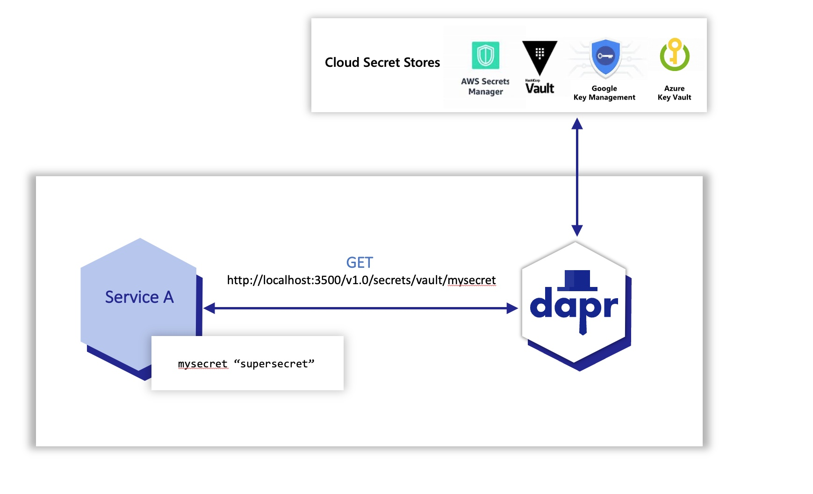
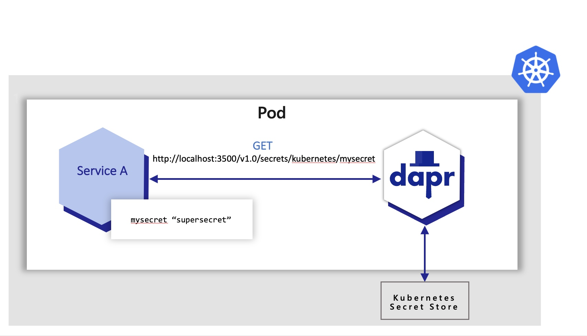

# Огляд управління секретами (Secrets management overview)

**Огляд будівельного блоку API керування секретами**
(Overview of secrets management API building block)

Програми зазвичай зберігають конфіденційну інформацію в секретах, використовуючи спеціальне сховище секретів. Наприклад, ви автентифікуєте бази даних, служби та зовнішні системи за допомогою рядків з'єднання, ключів, токенів та інших секретів рівня програми, що зберігаються у сховищі секретів, такому як [AWS Secrets Manager, Azure Key Vault, Hashicorp Vault тощо](https://docs.dapr.io/reference/components-reference/supported-secret-stores/).

>(Applications usually store sensitive information in secrets by using a dedicated secret store. For example, you authenticate databases, services, and external systems with connection strings, keys, tokens, and other application-level secrets stored in a secret store, such as AWS Secrets Manager, Azure Key Vault, Hashicorp Vault, etc.)

Щоб отримати доступ до цих секретних сховищ, програма імпортує SDK секретного сховища, що часто вимагає значної кількості незв'язаного шаблонного коду. Це створює ще більшу проблему в мультихмарних сценаріях, де можуть використовуватися секретні сховища різних постачальників.

>(To access these secret stores, the application imports the secret store SDK, often requiring a fair amount of unrelated boilerplate code. This poses an even greater challenge in multi-cloud scenarios, where different vendor-specific secret stores may be used)

## API керування секретами (Secrets management API)

Спеціальний API будівельного блоку секретів Dapr полегшує розробникам використання секретів додатків зі сховища секретів. Щоб скористатися будівельним блоком сховища секретів Dapr, ви:

>(_Dapr’s dedicated secrets building block API makes it easier for developers to consume application secrets from a secret store. To use Dapr’s secret store building block, you:_)

1. Налаштуйте компонент для конкретного рішення секретного сховища. (_Set up a component for a specific secret store solution._)
2. Отримання секретів за допомогою Dapr secrets API в коді програми. (_Retrieve secrets using the Dapr secrets API in the application code._)
3. Необов'язково, посилання на секрети у файлах компонентів Dapr (_Optionally, reference secrets in Dapr component files._)

## Особливості (Features)

Будівельний блок API управління секретами додає кілька функцій до вашого додатку.

>(_The secrets management API building block brings several features to your application._)

### Налаштування секретів без зміни коду програми (Configure secrets without changing application code)

Ви можете викликати API секретів у коді вашого додатку, щоб отримати і використовувати секрети зі сховищ секретів, що підтримуються Dapr. Подивіться це [відео](https://www.youtube.com/watch?v=OtbYCBt9C34&t=1818), щоб дізнатися, як можна використовувати API управління секретами у вашому додатку

>(You can call the secrets API in your application code to retrieve and use secrets from Dapr supported secret stores. Watch this [video](https://www.youtube.com/watch?v=OtbYCBt9C34&t=1818) for an example of how the secrets management API can be used in your application.)

Наприклад, на схемі нижче показано додаток, який запитує секрет під назвою "mysecret" зі сховища секретів під назвою "vault" з налаштованого хмарного сховища секретів.

>(_For example, the diagram below shows an application requesting the secret called “mysecret” from a secret store called “vault” from a configured cloud secret store._)

Програми також можуть використовувати API секретів 
для доступу до секретів зі сховища секретів 
Kubernetes. 
За замовчуванням Dapr вмикає вбудоване сховище секретів Kubernetes у режимі Kubernetes, розгорнуте за допомогою:
(_Applications can also use the secrets API to access secrets from a Kubernetes secret store. By default, Dapr enables a built-in Kubernetes secret store in Kubernetes mode, deployed via:)

- (_The Helm defaults, or_)
- (_`dapr init -k`_)

Якщо ви використовуєте інше сховище секретів, 
ви можете вимкнути (не налаштовувати) сховище
секретів Dapr Kubernetes, встановивши значення `disable-builtin-k8s-secret-store` у `true`
у налаштуваннях Helm. За замовчуванням встановлено значення `false`.

>(_If you are using another secret store, you can disable (not configure) the Dapr Kubernetes secret store by setting `disable-builtin-k8s-secret-store` to `true` through the Helm settings. The default is `false`._)

В Azure ви можете налаштувати Dapr на отримання секретів за допомогою керованих ідентичностей для автентифікації в `Azure Key Vault`. У прикладі нижче:
(_In Azure, you can configure Dapr to retrieve secrets using managed identities to authenticate with Azure Key Vault. In the example below:_)

1. Кластер [Azure Kubernetes Service (AKS)](https://docs.microsoft.com/azure/aks) налаштовано на використання керованих ідентичностей. (_An [Azure Kubernetes Service (AKS) cluster](https://docs.microsoft.com/azure/aks) is configured to use managed identities._)
2. Dapr використовує [ідентифікатори підів](https://docs.microsoft.com/azure/aks/operator-best-practices-identity#use-pod-identities) для отримання секретів зі сховища Azure Key Vault від імені програми. (_Dapr uses [pod identities](https://docs.microsoft.com/azure/aks/operator-best-practices-identity#use-pod-identities) to retrieve secrets from Azure Key Vault on behalf of the application._)

### Еталонні сховища секретів у компонентах Dapr (Reference secret stores in Dapr components)

У наведених вище прикладах код програми не потрібно було змінювати, щоб отримати той самий секрет. Dapr використовує компоненти керування секретами через API будівельного блоку керування секретами.

>(_In the examples above, the application code did not have to change to get the same secret. Dapr uses the secret management components via the secrets management building block API._)

Для отримання додаткової інформації прочитайте посилання на секретні сховища в компонентах.

>(_Try out the secrets API using one of our quickstarts or tutorials.)

### Обмежити доступ до секретів (Limit access to secrets)

Щоб забезпечити більш детальний контроль доступу до секретів, Dapr надає можливість визначати області видимості та обмежувати права доступу. Дізнайтеся більше про використання області видимості секретів

>(To provide more granular control on access to secrets, Dapr provides the ability to define scopes and restricting access permissions. Learn more about [using secret scoping](https://docs.dapr.io/developing-applications/building-blocks/secrets/secrets-scopes/))

## Спробуйте керування секретами (Try out secrets management)

### Короткі інструкції та навчальні посібники (Quickstarts and tutorials)

Хочете протестувати API управління секретами Dapr? Пройдіть через наступний швидкий старт і навчальні посібники, щоб побачити секрети Dapr в дії:

>(_Want to put the Dapr secrets management API to the test? Walk through the following quickstart and tutorials to see Dapr secrets in action:_)

| Quickstart/tutorial| Description |
|---|---|
| [Secrets management quickstart](https://docs.dapr.io/getting-started/quickstarts/secrets-quickstart/) | 	Retrieve secrets in the application code from a configured secret store using the secrets management API. |
| [Secret Store tutorial](https://github.com/dapr/quickstarts/tree/master/tutorials/secretstore)       | 	Demonstrates the use of Dapr Secrets API to access secret stores.                                         |

### Почніть керувати секретами безпосередньо у своєму додатку (Start managing secrets directly in your app)

>(_Want to skip the quickstarts? Not a problem. You can try out the secret management building block directly in your application to retrieve and manage secrets. After Dapr is installed, you can begin using the secrets management API starting with the secrets how-to guide._)