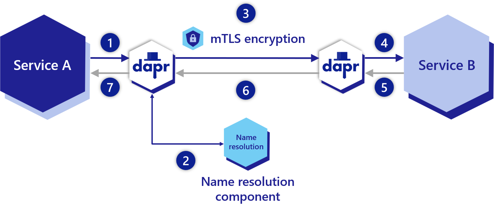
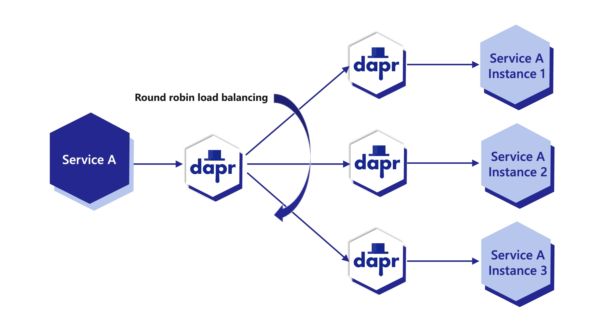

# Огляд виклику послуг (Service invocation overview)

**Огляд будівельного блоку API виклику сервісів**
(**Overview of the service invocation API building block**)

Використовуючи виклик сервісів, ваш додаток може надійно і безпечно 
взаємодіяти з іншими додатками за допомогою стандартних 
протоколів gRPC або HTTP

(Using service invocation, your application can reliably and securely 
communicate with other applications using the standard 
gRPC or HTTP protocols.)

У багатьох мікросервісних додатках декілька сервісів повинні мати 
можливість взаємодіяти один з одним. Ця міжсервісна взаємодія 
вимагає від розробників додатків вирішення таких проблем, як:

(In many microservice-based applications multiple services 
need the ability to communicate with one another. This inter-service communication requires 
that application developers handle problems like:)

- Відкриття послуг. Як знайти різні послуги? (**Service discovery**. How do I discover my different services?)
- Стандартизація викликів API між сервісами. Як викликати методи між сервісами? (**Standardizing API calls between services**. How do I invoke methods between services?)
- Безпечна міжсервісна комунікація. Як безпечно викликати інші сервіси за допомогою шифрування та застосувати контроль доступу до методів? (**Secure inter-service communication**. How do I call other services securely with encryption and apply access control on the methods?)
- Пом'якшення тайм-аутів запитів або збоїв. Як обробляти повторні спроби та перехідні помилки? (**Mitigating request timeouts or failures**. How do I handle retries and transient errors?)
- Впровадження спостережуваності та трасування. Як використовувати трасування, щоб побачити графік викликів з метриками для діагностики проблем у виробництві? (**Implementing observability and tracing**. How do I use tracing to see a call graph with metrics to diagnose issues in production?)

## API виклику сервісів (Service invocation API)

Dapr вирішує ці проблеми, надаючи API виклику сервісів, який діє подібно до зворотного проксі з вбудованим виявленням сервісів, використовуючи при цьому вбудовану розподілену трасування, метрики, обробку помилок, шифрування і багато іншого.

(Dapr addresses these challenges by providing a service invocation API that acts similar to a reverse proxy with built-in service discovery, while leveraging built-in distributed tracing, metrics, error handling, encryption and more.)

Dapr використовує архітектуру sidecar. 
Щоб викликати програму за допомогою Dapr:

(Dapr uses a sidecar architecture. To invoke an application using Dapr:)

- Ви використовуєте API `invoke` на екземплярі Dapr. (You use the `invoke` API on the Dapr instance.)
- Кожна програма взаємодіє з власним екземпляром Dapr. (Each application communicates with its own instance of Dapr.)
- Екземпляри Dapr знаходять і спілкуються один з одним. (The Dapr instances discover and communicate with each other.)

 На наведеній нижче схемі показано, як працює виклик сервісу Dapr. 
 
(The diagram below is an overview of how Dapr’s service invocation works.)

1. Сервіс **A** робить HTTP або gRPC-дзвінок до сервісу **B**. Дзвінок надходить на локальний sidecar Dapr (Service A makes an HTTP or gRPC call targeting Service B. The call goes to the local Dapr sidecar.)
2. Dapr визначає місцезнаходження сервісу **B** за допомогою компонента визначення імен, який працює на даній хостинговій платформі (Dapr discovers Service B’s location using the name resolution component which is running on the given hosting platform.)
3. Dapr пересилає повідомлення на sidecar Dapr Служби **B** (Dapr forwards the message to Service B’s Dapr sidecar)
   1. Всі дзвінки між sidecar Dapr проходять через gRPC для підвищення продуктивності. Тільки дзвінки між сервісами та sidecar Dapr можуть бути або HTTP, або gRPC. (**Note:** All calls between Dapr sidecars go over gRPC for performance. Only calls between services and Dapr sidecars can be either HTTP or gRPC.)
4. Dapr-sidecar сервісу **B** перенаправляє запит до вказаної кінцевої точки (або методу) на сервісі **B**. Після цього сервіс **B** запускає свій код бізнес-логіки (Service B’s Dapr sidecar forwards the request to the specified endpoint (or method) on Service B. Service B then runs its business logic code.)
5. Служба **B** надсилає відповідь службі **А**. Відповідь надходить на sidecar служби **B**.(Service B sends a response to Service A. The response goes to Service B’s sidecar.)
6. Dapr пересилає відповідь на sidecar Dapr Служби **А** (Dapr forwards the response to Service A’s Dapr sidecar.)
7. Сервіс **A** отримує відповідь (Service A receives the response.)

## Особливості (Features)

Виклик сервісів надає декілька функцій, які спрощують виклик методів між додатками

(Service invocation provides several features to make it easy for you to call methods between applications)

### Виклик сервісів HTTP та gRPC (HTTP and gRPC service invocation)

- **HTTP**: Якщо ви вже використовуєте протоколи HTTP у своєму додатку, використання заголовка Dapr HTTP може бути найпростішим способом почати роботу. Вам не потрібно змінювати існуючі URL-адреси кінцевих точок; просто додайте заголовок `dapr-app-id` і ви готові до роботи. Докладнішу інформацію можна знайти у статті **Виклик служб за допомогою HTTP** (HTTP: If you’re already using HTTP protocols in your application, using the Dapr HTTP header might be the easiest way to get started. You don’t need to change your existing endpoint URLs; just add the dapr-app-id header and you’re ready to go. For more information, see Invoke Services using HTTP)
- **gRPC**: Dapr дозволяє користувачам зберігати власні прото-сервіси і працювати з gRPC нативно. Це означає, що ви можете використовувати виклик служб для виклику існуючих gRPC-додатків без необхідності встановлювати будь-які `Dapr SDK` або включати власні служби gRPC. Для отримання додаткової інформації див. **посібник з Dapr і gRPC**  (gRPC: Dapr allows users to keep their own proto services and work natively with gRPC. This means that you can use service invocation to call your existing gRPC apps without having to include any Dapr SDKs or include custom gRPC services. For more information, see the how-to tutorial for Dapr and gRPC)
### Безпека між послугами (Service-to-service security)

За допомогою сервісу Dapr Sentry всі дзвінки між додатками 
Dapr можна захистити за допомогою взаємної автентифікації (mTLS) 
на хостингових платформах, включаючи автоматичне оновлення 
сертифікатів.

(With the Dapr Sentry service, all calls between Dapr applications can be made secure with mutual (mTLS) authentication on hosted platforms, including automatic certificate rollover)

### Стійкість, включаючи повторні спроби (Resiliency including retries)

На випадок збоїв виклику та перехідних помилок, 
виклик сервісу забезпечує функцію відмовостійкості, 
яка виконує автоматичні повторні спроби з періодами очікування. 
Щоб дізнатися більше, перегляньте статтю про відмовостійкість тут

(In the event of call failures and transient errors, service invocation provides a resiliency feature that performs automatic retries with backoff time periods. To find out more, see the Resiliency article here)

### Відстеження та метрики з можливістю спостереження (Tracing and metrics with observability)

За замовчуванням всі дзвінки між додатками відстежуються і 
збираються метрики, щоб забезпечити розуміння і діагностику додатків. 
Це особливо важливо у виробничих сценаріях, коли ви отримуєте графіки
викликів і метрики викликів між вашими сервісами. 
Для отримання додаткової інформації читайте про спостережуваність

(By default, all calls between applications are traced and metrics are gathered to provide insights and diagnostics for applications. This is especially important in production scenarios, providing call graphs and metrics on the calls between your services. For more information read about observability)

### Контроль доступу (Access control)

За допомогою політик доступу програми можуть контролювати:

(With access policies, applications can control:)

- Яким програмам дозволено їх викликати (Which applications are allowed to call them.)
- Що можуть робити додатки. (What applications are authorized to do.)

Наприклад, ви можете обмежити доступ несанкціонованих додатків 
до конфіденційних додатків з інформацією про персонал. 
У поєднанні із захищеним зв'язком між сервісами ви можете 
забезпечити м'яке розгортання багатокористувацьких середовищ

(For example, you can restrict sensitive applications with personnel information from being accessed by unauthorized applications. Combined with service-to-service secure communication, you can provide for soft multi-tenancy deployments.)

Для отримання додаткової інформації прочитайте статтю 
про списки дозволів контролю доступу для виклику служб

(For more information read the access control allow lists for service invocation article)

### Обмеження простору імен (Namespace scoping)

Ви можете прив'язати програми до просторів імен для 
розгортання та безпеки, а також викликати служби, розгорнуті 
у різних просторах імен. Докладні відомості наведено 
у статті Виклик служб у різних просторах імен

(You can scope applications to namespaces for deployment and security and call between services deployed to different namespaces. For more information, read the Service invocation across namespaces article)

### Кругове балансування навантаження за допомогою mDNS (Round robin load balancing with mDNS)

Dapr забезпечує циклічне балансування навантаження запитів 
на виклик послуг за допомогою протоколу mDNS, 
наприклад, на одній машині або на декількох, об'єднаних в мережу, 
фізичних машинах.

(Dapr provides round robin load balancing of service invocation requests with the mDNS protocol, for example with a single machine or with multiple, networked, physical machines.)

На схемі нижче показано приклад того, як це працює. 
Якщо у вас є 1 екземпляр програми з ідентифікатором `FrontEnd` 
і 3 екземпляри програми з ідентифікатором `Cart`, 
і ви викликаєте додаток з `FrontEnd` до додатка `Cart`, 
Dapr виконує обхід між цими 3 екземплярами. 
Ці екземпляри можуть бути на одній машині або на різних машинах.

(The diagram below shows an example of how this works. If you have 1 instance of an application with app ID FrontEnd and 3 instances of application with app ID Cart and you call from FrontEnd app to Cart app, Dapr round robins’ between the 3 instances. These instance can be on the same machine or on different machines.)

**Примітка**: Ідентифікатор програми є унікальним для кожної програми, 
а не для екземпляра програми. 
Незалежно від того, скільки екземплярів програми існує 
(через масштабування), всі вони матимуть однаковий 
ідентифікатор програми.

(Note: App ID is unique per application, not application instance. Regardless how many instances of that application exist (due to scaling), all of them will share the same app ID.)
### Виявлення служб, що підключаються (Pluggable service discovery)

Dapr може працювати на різних хостингових платформах. 
Щоб уможливити виявлення та виклик сервісів, Dapr використовує компоненти 
вирішення імен, що підключаються. Наприклад, компонент розв'язання імен 
Kubernetes використовує службу DNS Kubernetes для визначення 
місцезнаходження інших програм, запущених у кластері. 
Самостійно розміщені машини можуть використовувати компонент 
вирішення імен mDNS. 
Компонент розв'язання імен `Consul` можна використовувати 
у будь-якому хостинговому середовищі, зокрема у 
`Kubernetes` або на власному хостингу.

(Dapr can run on a variety of hosting platforms. To enable service discovery and service invocation, Dapr uses pluggable name resolution components. For example, the Kubernetes name resolution component uses the Kubernetes DNS service to resolve the location of other applications running in the cluster. Self-hosted machines can use the mDNS name resolution component. The Consul name resolution component can be used in any hosting environment, including Kubernetes or self-hosted)

## Приклад архітектури (Example Architecture)