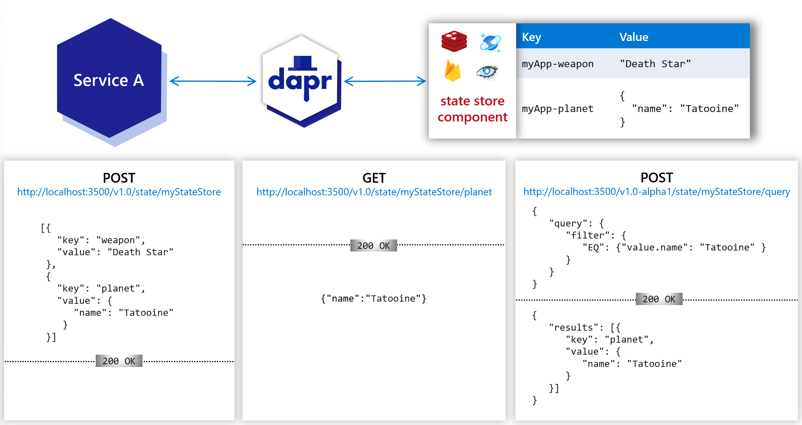

# Огляд управління станами (State management overview)

**Огляд будівельного блоку API управління станом**
(**Overview of the state management API building block**)

Ваш додаток може використовувати API управління станами Dapr для збереження, 
читання та запиту пар ключ/значення у підтримуваних сховищах станів. 
Використовуючи компонент сховища станів, ви можете створювати довготривалі додатки, 
які зберігають і відновлюють свій стан (наприклад, кошик для покупок або стан сеансу гри). 
Наприклад, як на схемі нижче:

>(_Your application can use Dapr’s state management API to save, read, and query 
> key/value pairs in the supported state stores. Using a state store component, 
> you can build stateful, long running applications that save and retrieve their state 
> (like a shopping cart or a game’s session state). For example, in the diagram below:_)

- Використовуйте HTTP POST для збереження або запиту пар ключ/значення (_Use HTTP POST to save or query key/value pairs._)
- Використовуйте HTTP GET, щоб прочитати певний ключ і отримати його значення (_Use HTTP GET to read a specific key and have its value returned._)

- 

## Особливості (Features)

За допомогою будівельного блоку API управління станом ваш додаток 
може використовувати функції, які зазвичай є складними та схильними 
до помилок при створенні:

>(_With the state management API building block, your application can 
> leverage features that are typically complicated and error-prone to build, including:_)

- Встановлення параметрів контролю паралелізму та узгодженості даних. (_Setting the choices on concurrency control and data consistency._)
- Виконання масових операцій оновлення CRUD, включаючи кілька транзакційних операцій (_Performing bulk update operations CRUD including multiple transactional operations._)
- Запити та фільтрація даних ключ/значення. (_Querying and filtering the key/value data._)

Ось функції, доступні як частина API для управління станом:

>(_These are the features available as part of the state management API:_)

### Знімні сховища станів (Pluggable state stores)

Сховища даних Dapr моделюються як компоненти, які можна замінити без будь-яких змін 
у вашому сервісному коді. Список підтримуваних сховищ даних можна переглянути 
у розділі [Підтримувані сховища даних](https://docs.dapr.io/reference/components-reference/supported-state-stores/)

>(_Dapr data stores are modeled as components, which can be swapped out without any changes 
> to your service code. See supported state stores to see the list._)

### Налаштовувана поведінка сховища станів (Configurable state store behaviors)

За допомогою Dapr ви можете включити додаткові метадані до запиту 
на операцію стану, які описують, як ви очікуєте, що запит буде оброблено. 
Ви можете прикріпити:

>(_With Dapr, you can include additional metadata in a state operation request that describes 
> how you expect the request to be handled. You can attach:_)

- Вимоги до паралельності (_Concurrency requirements_)
- Вимоги до узгодженості (_Consistency requirements_)

За замовчуванням ваша програма повинна припускати, що сховище даних 
є послідовним і використовує шаблон паралелізму за шаблоном "останнього запису"

>(_By default, your application should assume a data store is eventually consistent and 
> uses a last-write-wins concurrency pattern._)


Не всі сховища створені однаково. Щоб забезпечити мобільність вашого додатку, 
ви можете запитувати можливості метаданих сховища і зробити свій код адаптивним 
до різних можливостей сховища.

>(_Not all stores are created equal. To ensure your application’s portability, you can query the metadata capabilities of the store and make your code adaptive to different store capabilities._)

### Паралельність (Concurrency)

Dapr підтримує оптимістичний контроль паралелізму (OCC) за допомогою тегів ETags. 
Коли запитується значення стану, Dapr завжди прикріплює властивість ETag до повернутого стану. 
Коли користувацький код:

>(_Dapr supports Optimistic Concurrency Control (OCC) using ETags. 
> When a state value is requested, Dapr always attaches an ETag property to the returned state. 
> When the user code:_)

- Оновлює стан, очікується, що він додасть ETag через тіло запиту. (_**Updates a state**, it’s expected to attach the ETag through the request body._)
- Видаляє стан, очікується, що він приєднає ETag через заголовок `If-Match` (_**Deletes a state**, it’s expected to attach the ETag through the `If-Match` header._)

Операція запису є успішною, якщо наданий ETag збігається з ETag у сховищі стану

>(_The `write` operation succeeds when the provided ETag matches the ETag in the state store._)

### Чому Dapr обирає оптимістичний контроль паралелізму (OCC) (Why Dapr chooses optimistic concurrency control (OCC))

Конфлікти оновлення даних рідко виникають у багатьох додатках, 
оскільки клієнти природно розділені бізнес-контекстами для роботи з різними даними. 
Однак, якщо ваша програма використовує ETags, невідповідність ETags може призвести 
до відхилення запиту. 
Рекомендується використовувати політику повторних спроб у вашому коді для компенсації 
конфліктів при використанні ETags.

> (_Data update conflicts are rare in many applications, since clients are naturally partitioned by business contexts to operate on different data. However, if your application chooses to use ETags, mismatched ETags may cause a request rejection. It’s recommended you use a retry policy in your code to compensate for conflicts when using ETags._)

Якщо ваша програма не використовує ETags у запитах на запис, 
Dapr пропускає перевірку ETags під час обробки запитів. 
Це дозволяє використовувати шаблон останнього запису, а не шаблон першого запису з тегами ETags.

> (_If your application omits ETags in writing requests, Dapr skips ETag checks while handling the requests. This enables the last-write-wins pattern, compared to the first-write-wins pattern with ETags._)

>Примітка щодо тегів ETags
> Для сховищ, які не підтримують ETags, відповідна реалізація сховища станів Dapr має імітувати 
> ETags та слідувати специфікації API управління станами Dapr при обробці станів. 
> Оскільки реалізації сховища станів Dapr технічно є клієнтами базового сховища даних, 
> симуляція має бути простою, з використанням механізмів контролю паралелізму, наданих сховищем.

 
>> **Note on ETags**
>> 
>> For stores that don’t natively support ETags, the corresponding Dapr state store implementation is expected to simulate ETags and follow the Dapr state management API specification when handling states. Since Dapr state store implementations are technically clients to the underlying data store, simulation should be straightforward, using the concurrency control mechanisms provided by the store.
>> Read the API reference to learn how to set concurrency options.

### Послідовність (Consistency)

Dapr підтримує як **сильну узгодженість**, так і **можливу узгодженість**, причому можлива 
узгодженість є поведінкою за замовчуванням

>(_Dapr supports both strong consistency and eventual consistency, with eventual consistency as the default behavior._)

- Сильна послідовність: Dapr чекає на підтвердження всіх реплік (або визначеного кворуму), перш ніж підтвердити запит на запис. (_Strong consistency: Dapr waits for all replicas (or designated quorums) to acknowledge before it acknowledges a write request._)
- Можлива узгодженість: Dapr повертається, як тільки запит на запис прийнято базовим сховищем даних, навіть якщо це одна репліка. (_Eventual consistency: Dapr returns as soon as the write request is accepted by the underlying data store, even if this is a single replica.)

Read the [API reference](https://docs.dapr.io/reference/api/state_api/) to learn how to set consistency options.

### Налаштування типу вмісту (Setting content type)

Компоненти сховища станів можуть зберігати та маніпулювати даними по-різному, 
залежно від типу контенту. Dapr підтримує передачу типу вмісту в API керування 
станом як частину метаданих запиту

>(_State store components may maintain and manipulate data differently, depending on the content type. Dapr supports passing content type in state management API as part of request metadata._)

Встановлення типу вмісту _не є обов'язковим_, і компонент сам вирішує, чи використовувати його. 
Dapr лише надає засоби передачі цієї інформації до компонента.

>(Setting the content type is _optional_, and the component decides whether to make use of it. Dapr only provides the means of passing this information to the component.)

- (With the HTTP API: Set content type via URL query parameter `metadata.contentType`. For example, `http://localhost:3500/v1.0/state/store?metadata.contentType=application/json`.)
- (With the gRPC API: Set content type by adding key/value pair `"contentType" : <content type>` to the request metadata.)

### Кілька операцій (Multiple operations)

Dapr підтримує два типи операцій багатократного читання або багатократного запису: 
масові або транзакційні. 
Прочитайте [довідник API](https://docs.dapr.io/reference/api/state_api/), щоб дізнатися, як використовувати опції 
масового та багатократного читання і запису.

>(_Dapr supports two types of multi-read or multi-write operations: bulk or transactional. Read the API reference to learn how use bulk and multi options._)

#### Операції масового читання  (Bulk read operations)

Ви можете об'єднати декілька запитів на читання у групову (або пакетну) операцію. 
Під час масової операції Dapr надсилає запити на читання як окремі запити 
до основного сховища даних і повертає їх як єдиний результат

>(_You can group multiple read requests into a bulk (or batch) operation. In the bulk operation, Dapr submits the read requests as individual requests to the underlying data store, and returns them as a single result._)

#### Транзакційні операції (Transactional operations)

Ви можете об'єднати операції запису, оновлення та видалення у запит, який потім обробляється як атомарна транзакція. 
Запит буде виконано успішно або невдало як транзакційний набір операцій

>(_You can group write, update, and delete operations into a request, which are then handled as an atomic transaction. The request will succeed or fail as a transactional set of operations._)

### Стан акторів (Actor state)

Для зберігання стану акторів можна використовувати транзакційні сховища станів. 
Щоб вказати, яке сховище станів використовувати для акторів, вкажіть значення властивості `actorStateStore` як `true` 
у секції метаданих компонента сховища станів. 
Стан акторів зберігається за певною схемою у транзакційних сховищах станів, що дозволяє здійснювати узгоджені запити. 
Лише один компонент сховища станів може бути використаний як сховище станів для всіх акторів. 
Щоб дізнатися більше про [сховища станів для акторів](https://docs.dapr.io/reference/api/state_api/), 
прочитайте посилання на API state та [API actors](https://docs.dapr.io/reference/api/actors_api/), 
щоб дізнатися більше про сховища станів для акторів.

>(_Transactional state stores can be used to store actor state. To specify which state store to use for actors, specify value of property actorStateStore as true in the state store component’s metadata section. Actors state is stored with a specific scheme in transactional state stores, allowing for consistent querying. Only a single state store component can be used as the state store for all actors. Read the state API reference and the actors API reference to learn more about state stores for actors._)

### Шифрування стану (State encryption)

Dapr підтримує автоматичне клієнтське шифрування стану програми з підтримкою ротації ключів. 
Це підтримується на всіх сховищах станів Dapr. 
Для отримання додаткової інформації, прочитайте тему [Як зашифрувати стан додатку](https://docs.dapr.io/developing-applications/building-blocks/state-management/howto-encrypt-state/)

>(_Dapr supports automatic client encryption of application state with support for key rotations. This is supported on all Dapr state stores. For more info, read the How-To: Encrypt application state topic._)

### Спільне використання стану між додатками (Shared state between applications)

Потреби різних програм відрізняються, коли йдеться про спільний доступ до стану. 
В одному випадку ви можете захотіти інкапсулювати весь стан у певній програмі і дозволити Dapr керувати доступом до нього. 
В іншому випадку вам може знадобитися, щоб дві програми, які працюють з одним і тим самим станом, 
отримували і зберігали однакові ключі

>(_Different applications’ needs vary when it comes to sharing state. In one scenario, you may want to encapsulate all state within a given application and have Dapr manage the access for you. In another scenario, you may want two applications working on the same state to get and save the same keys._)

Dapr дозволяє стана бути: (_Dapr enables states to be:_)

- Ізольованими для програми (_Isolated to an application._)
- Спільно використовуваними у сховищі станів між додатками. (_Shared in a state store between applications._)
- Спільно використовуватися кількома програмами у різних сховищах станів (_Shared between multiple applications across different state stores._)

Для більш детальної інформації читайте: [Як обмінюватися станом між додатками](https://docs.dapr.io/developing-applications/building-blocks/state-management/howto-share-state/)
>(_For more details read How-To: Share state between applications,_)

### Запит стану (Querying state)

Існує два способи подати запит до сховища: 
(_There are two ways to query the state:_)

- Використання API запиту на управління станом, що надається у середовищі виконання Dapr (_Using the state management query API provided in Dapr runtime._)
- Запит до сховища станів безпосередньо за допомогою власного SDK сховища (_Querying state store directly with the store’s native SDK._)

### API Запитів (Query API)

Використовуючи _опціональний_ API запитів для керування станами, ви можете запитувати дані про ключ/значення, 
збережені в сховищах станів, незалежно від базової бази даних або технології зберігання. 
За допомогою API запитів керування станами ви можете фільтрувати, сортувати і розбивати дані ключів/значень на сторінки. 
Щоб дізнатися більше, прочитайте статтю [Як це зробити: Запит стану](https://docs.dapr.io/developing-applications/building-blocks/state-management/howto-state-query-api/).

>(_Using the optional state management query API, you can query the key/value data saved in state stores, regardless of underlying database or storage technology. With the state management query API, you can filter, sort, and paginate the key/value data. For more details read How-To: Query state._)

### Запит до сховища стану напряму (Querying state store directly)

Dapr зберігає та отримує значення станів без будь-яких перетворень. 
Ви можете запитувати та агрегувати стани безпосередньо зі сховища станів. 
Наприклад, щоб отримати всі ключі станів, пов'язані з ідентифікатором додатку "myApp" в Redis, 
використовуйте:

>(_Dapr saves and retrieves state values without any transformation. You can query and aggregate state directly from the underlying state store. For example, to get all state keys associated with an application ID “myApp” in Redis, use:_)

```
KEYS "myApp*"
```

>**Примітка щодо прямих запитів**
> Оскільки ви звертаєтеся не через середовище виконання Dapr, прямі запити до сховища даних не керуються контролем паралелізму Dapr. 
> Те, що ви бачите, - це знімки зафіксованих даних, прийнятні для запитів тільки на читання між декількома акторами. 
> Запис має здійснюватися через API управління станами Dapr або акторів

>>**Note on direct queries**
>>Since you aren’t calling through the Dapr runtime, direct queries of the state store are not governed by Dapr concurrency control. What you see are snapshots of committed data acceptable for read-only queries across multiple actors. Writes should be done via the Dapr state management or actors APIs.

### Запит стану акторів (Querying actor state)

Якщо сховище даних підтримує SQL-запити, ви можете запитувати стан актора за допомогою SQL-запитів. Наприклад:

>(_If the data store supports SQL queries, you can query an actor’s state using SQL queries. For example:_)

```sql
SELECT * FROM StateTable WHERE Id='<app-id>||<actor-type>||<actor-id>||<key>'
```
Ви також можете уникнути поширених обмежень покрокового паралелізму фреймворків акторів, 
виконуючи агреговані запити до всіх екземплярів акторів. 
Наприклад, щоб обчислити середню температуру всіх акторів-термометрів, використовуйте:

>(_You can also avoid the common turn-based concurrency limitations of actor frameworks by performing aggregate queries across actor instances. For example, to calculate the average temperature of all thermometer actors, use:_)

```sql
SELECT AVG(value) FROM StateTable WHERE Id LIKE '<app-id>||<thermometer>||*||temperature'
```

### Тривалість життя стану (State Time-to-Live (TTL))

Dapr дозволяє [встановлювати для кожного стану час життя запиту (TTL)](https://docs.dapr.io/developing-applications/building-blocks/state-management/state-store-ttl/). 
Це означає, що програми можуть встановлювати час життя для кожного збереженого стану, 
і ці стани не можуть бути відновлені після закінчення терміну дії.

>(_Dapr enables per state set request time-to-live (TTL). This means that applications can set time-to-live per state stored, and these states cannot be retrieved after expiration._)

### API керування станами (State management API)

API управління станами можна знайти [в довіднику API управління станами](https://docs.dapr.io/reference/api/state_api/), 
який описує, як отримувати, зберігати, видаляти та запитувати значення станів, надаючи ключі

>(_The state management API can be found in the state management API reference, which describes how to retrieve, save, delete, and query state values by providing keys._)

## Try out state management
### Quickstarts and tutorials

Хочете протестувати API управління станом Dapr? Перегляньте наведені нижче швидкий старт 
та навчальні посібники, щоб побачити управління станом в дії:

>(_Want to put the Dapr state management API to the test? Walk through the following quickstart and tutorials to see state management in action:_)

|Quickstart/tutorial| 	Description                                                                                                |
|---|-------------------------------------------------------------------------------------------------------------|
|[State management quickstart](https://docs.dapr.io/getting-started/quickstarts/statemanagement-quickstart/)|	Create stateful applications using the state management API.|
|[Hello World](https://github.com/dapr/quickstarts/tree/master/tutorials/hello-world)| 	Recommended<br/> Demonstrates how to run Dapr locally. Highlights service invocation and state management. |
|[Hello World Kubernetes](https://github.com/dapr/quickstarts/tree/master/tutorials/hello-kubernetes)|	Recommended<br/>Demonstrates how to run Dapr in Kubernetes. Highlights service invocation and state management.|

### Почніть використовувати управління станами безпосередньо у вашому додатку (Start using state management directly in your app)

Хочете пропустити швидкий старт? Не проблема. Ви можете випробувати будівельний блок управління станами безпосередньо у вашому додатку. 
Після встановлення Dapr ви можете почати користуватися API керування станами,
починаючи [з посібника з керування станами](https://docs.dapr.io/developing-applications/building-blocks/state-management/howto-get-save-state/)

>(_Want to skip the quickstarts? Not a problem. You can try out the state management building block directly in your application. After Dapr is installed, you can begin using the state management API starting with the state management how-to guide_)