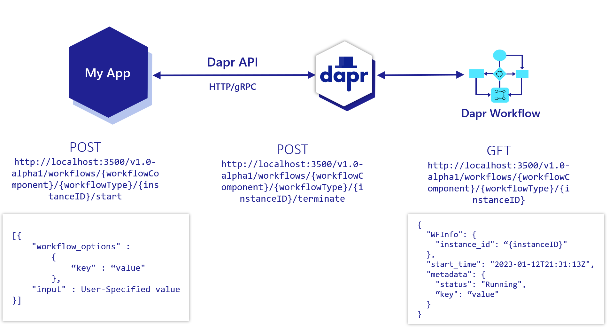

# Огляд робочого процесу (Workflow overview)

**Огляд робочого процесу Dapr**
(**Overview of Dapr Workflow**)

Dapr Workflow полегшує розробникам організацію логіки, необхідної для обміну повідомленнями, 
управління станом та обробки збоїв у різних мікросервісах. 
Dapr Workflow дозволяє створювати довготривалі, відмовостійкі, керовані станами додатки. 
До Dapr Workflow вам часто доводилося створювати спеціальні робочі процеси у спеціальному, 
складному коді, щоб створити довготривалі, відмовостійкі, керовані станами додатки.

>(_Dapr Workflow makes orchestrating the logic required for messaging, state management, and failure handling across various microservices easier for developers. Dapr Workflow enables you to create long running, fault-tolerant, stateful applications. Prior to Dapr Workflow, you’d often need to build ad-hoc workflows in custom, complex code in order to achieve long running, fault-tolerant, stateful applications._)

Довговічна, стійка до зовнішніх впливів система Dapr Workflow:
(The durable, resilient Dapr Workflow capability:)

- Пропонує вбудоване середовище виконання робочого процесу для керування виконанням Dapr Workflow (_Offers a built-in workflow runtime for driving Dapr Workflow execution_)
- Надає SDK для написання робочих процесів у коді будь-якою мовою (_Provides SDKs for authoring workflows in code, using any language_)
- Надає HTTP та gRPC API для керування робочими процесами (запуск, запит, призупинення/відновлення, завершення) (_Provides HTTP and gRPC APIs for managing workflows (start, query, suspend/resume, terminate)_)
- Інтегрується з будь-яким іншим середовищем виконання за допомогою компонентів робочого процесу (_Integrates with any other workflow runtime via workflow components_)

Деякі приклади сценаріїв, які може виконувати Dapr Workflow, наведені нижче:
(Some example scenarios that Dapr Workflow can perform are:)

- Обробка замовлень, включаючи управління запасами, платіжними системами, доставку тощо (_Order processing involving inventory management, payment systems, shipping, etc._)
- Робочі процеси адаптації персоналу, що координують завдання між різними відділами та учасниками (_HR onboarding workflows coordinating tasks across multiple departments and participants._)
- Організація впровадження цифрових оновлень меню в національній мережі ресторанів (_Orchestrating the roll-out of digital menu updates in a national restaurant chain._)
- Робочі процеси обробки зображень, що передбачають класифікацію та зберігання на основі API (_Image processing workflows involving API-based classification and storage_)

## Особливості (Features)
                                         
### Робочі процеси та заходи (Workflows and activities)

За допомогою Dapr Workflow ви можете писати завдання, а потім об'єднувати їх у робочий процес. 
Роботи в робочому процесі - це:

>(_With Dapr Workflow, you can write activites and then compose those activities together into a) workflow. Workflow activities are:_)
                                                                                             
- Основна одиниця роботи в робочому процесі (_The basic unit of work in a workflow_)
- Завдання, які впорядковуються в бізнес-процесі (_The tasks that get orchestrated in the business process_)

### Дочірні робочі процеси (Child workflows)

Крім дій, ви можете створювати робочі процеси, щоб планувати інші робочі процеси як дочірні. 
Дочірній сценарій не залежить від батьківського сценарію, який його запустив, 
і підтримує політику автоматичних повторних спроб.

>(_In addition to activities, you can write workflows to schedule other workflows as child workflows. A child workflow is independent of the parent workflow that started it and support automatic retry policies._)

[Дізнайтеся більше про дочірні робочі процеси](https://docs.dapr.io/developing-applications/building-blocks/workflow/workflow-features-concepts/#child-workflows)

### Таймери та нагадування (Timers and reminders)

Так само, як і актори Dapr, ви можете запланувати тривалі затримки, 
подібні до нагадувань, на будь-який часовий діапазон.
>(_Same as Dapr actors, you can schedule reminder-like durable delays for any time range_)

[Дізнайтеся більше про таймери](https://docs.dapr.io/developing-applications/building-blocks/workflow/workflow-features-concepts/#durable-timers) та [нагадування робочого процесу](https://docs.dapr.io/developing-applications/building-blocks/workflow/workflow-architecture/#reminder-usage-and-execution-guarantees)

>(_Learn more about workflow timers and reminders_)

### Робочий процес HTTP-виклики для керування робочим процесом (Workflow HTTP calls to manage a workflow)

Коли ви створюєте додаток з кодом робочого процесу і запускаєте його за допомогою Dapr, 
ви можете викликати певні робочі процеси, які знаходяться в додатку. 
Кожен окремий робочий процес може бути:

>(_When you create an application with workflow code and run it with Dapr, you can call specific workflows that reside in the application. Each individual workflow can be:_)

- Розпочато або завершено за допомогою POST-запиту (_Started or terminated through a POST request_)
- Запитується за допомогою GET-запиту (_Queried through a GET request_)

>(_[Learn more about how manage a workflow using HTTP calls](https://docs.dapr.io/reference/api/workflow_api/)_)

### Керуйте іншими виконаннями сценаріїв за допомогою компонентів сценаріїв (Manage other workflow runtimes with workflow components)

Ви можете викликати інші середовища виконання сценаріїв 
(наприклад, Temporal і Netflix Conductor), написавши власний компонент сценарію.

>(_You can call other workflow runtimes (for example, Temporal and Netflix Conductor) by writing your own workflow component_)

## Workflow patterns

Dapr Workflow спрощує складні вимоги до координації в мікросервісних архітектурах, що вимагають наявності стану. 
У наступних розділах описано кілька прикладних патернів, які можуть отримати вигоду від Dapr Workflow

>(Dapr Workflow simplifies complex, stateful coordination requirements in microservice architectures. The following sections describe several application patterns that can benefit from Dapr Workflow.)

Дізнайтеся більше про різні [типи шаблонів робочого процесу](https://docs.dapr.io/developing-applications/building-blocks/workflow/workflow-patterns/)

>(Learn more about different types of [workflow patterns](https://docs.dapr.io/developing-applications/building-blocks/workflow/workflow-patterns/))

### Workflow SDKs 

Авторські SDK Dapr Workflow - це специфічні для кожної мови SDK, які містять типи та функції для реалізації логіки робочого процесу. Логіка робочого процесу живе у вашому додатку і керується рушієм Dapr Workflow, який працює у візку Dapr через потік gRPC.

>(_The Dapr Workflow authoring SDKs are language-specific SDKs that contain types and functions to implement workflow logic. The workflow logic lives in your application and is orchestrated by the Dapr Workflow engine running in the Dapr sidecar via a gRPC stream_)
>
### Supported SDKs

>(_You can use the following SDKs to author a workflow._)

## Try out workflows
### Quickstarts and tutorials